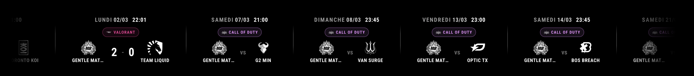
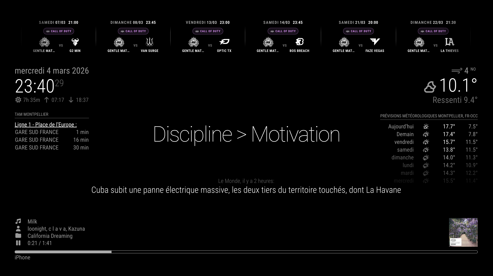

# MMM-GENTLEMATE-ESPORT

A [MagicMirror²](https://magicmirror.builders/) module that displays **Gentlemate esport** matches as a scrolling banner or a static list.

Data is fetched from the Gentlemate Supabase backend and refreshed automatically.

---

## Installation

```bash
cd ~/MagicMirror/modules
git clone https://github.com/FabienBounoir/MMM-GENTLEMATE-ESPORT.git
```

No external npm dependencies — only Node.js built-ins.

---

## Configuration

```js
{
  module: "MMM-GENTLEMATE-ESPORT",
  position: "bottom_bar",
  config: {
    email: "your@email.com",
    password: "yourPassword"
  }
}
```

## Screenshots



*Example of the scrolling banner showing upcoming matches.*



*Static list layout with dates, teams and scores.*


### All options

| Option | Default | Description |
|--------|---------|-------------|
| `email` | `""` | Supabase account e-mail |
| `password` | `""` | Supabase account password |
| `updateInterval` | `10` | Refresh interval in minutes |
| `numberOfFutureMatches` | `10` | Max upcoming matches to display |
| `numberOfPastMatches` | `3` | Max past matches to display |
| `pastDays` | `7` | How many days back to fetch past matches |
| `use24HourTime` | `true` | `false` for AM/PM format |
| `logoTheme` | `"dark"` | `"dark"` or `"white"` logo variant |
| `displayMode` | `"banner"` | `"banner"` (horizontal scroll) or `"list"` (vertical static) |
| `excludeGames` | `[]` | List of game `short_name` values to hide (see below) |

---

## Filtering games

Use `excludeGames` to hide matches for specific games. Pass an array of `short_name` values (case-insensitive).

```js
config: {
  excludeGames: ["TFT", "AOE"],  // hide Teamfight Tactics and Age of Empires
}
```

Available game identifiers:

| Game | `short_name` |
|------|-------------|
| Rocket League | `RL` |
| Fortnite | `Fortnite` |
| Valorant | `Valorant` |
| Counter-Strike 2 | `CS2` |
| Call of Duty | `CoD` |
| Warzone | `WZ` |
| Teamfight Tactics | `TFT` |
| Age of Empires | `AOE` |
| Fighting Games | `FGC` |

Leave `excludeGames` empty (default) to display all games.

---

## Features

- Two display modes: scrolling banner (`bottom_bar`) or static list (`top_right`, `bottom_right`)
- Game badge per match (logo + short name, coloured with the game's brand colour)
- Live match indicator (pulsing 🔴)
- Win/loss score colouring
- Featured match highlight
- JWT token caching — re-authenticates only on expiry
- Tri-lingual: English, French, Spanish

---

## License

MIT — Author: FabienBounoir
